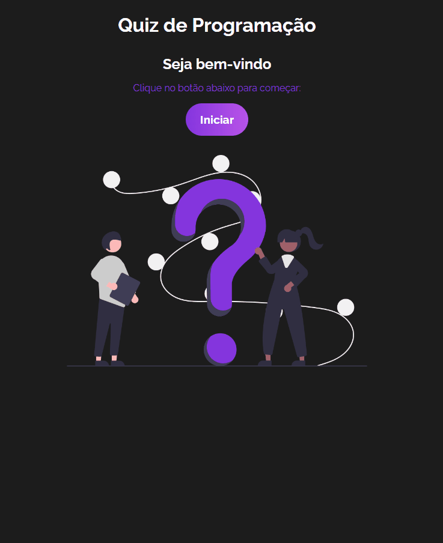
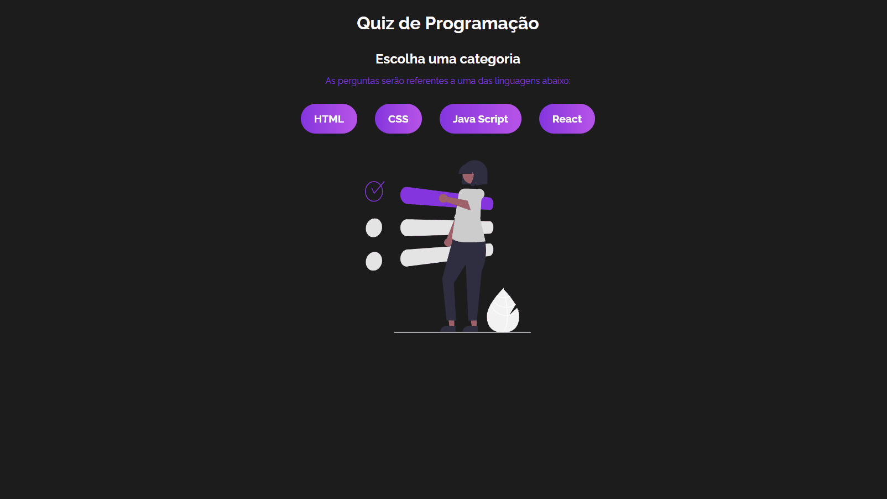

### Quiz Programação


O projeto Quiz  é uma aplicação web desenvolvida em React.js que permite aos usuários testar seus conhecimentos sobre a programação. É um quiz interativo com várias perguntas sobre linguagens. Os jogadores podem responder às perguntas e ver suas pontuações no final. É uma maneira divertida de desafiar seus conhecimentos!


## Índice
- <a href="#📱funcionalidades-do-projetofuncionalidades">Funcionalidades do projeto </a>
- <a href="#demonstração">Demonstração </a>
- <a href="#como-rodar-este-projeto">Como rodar este projeto? </a>
- <a href="#🛠️-tecnologias-utilizadas">Tecnologias utilizadas </a>
  

##📱funcionalidades-do-projetofuncionalidades

### Pontuação final
- [x] exibe uma pontuação com base nas respostas corretas ao final do quiz


### Feedback
-[x] os jogadores recebem um feedback imediato após responder cada pergunta, indicando se esta certo ou errado




## Demonstração


## Como rodar este Projeto?
```bash
# Clone este Repositório
$git clone LinkRepo


# Instale as depêndencias
$npm install

#execute a aplicação
$npm run start

```

## 🛠️ Tecnologias Utilizadas
1. [react](https://react.dev/)